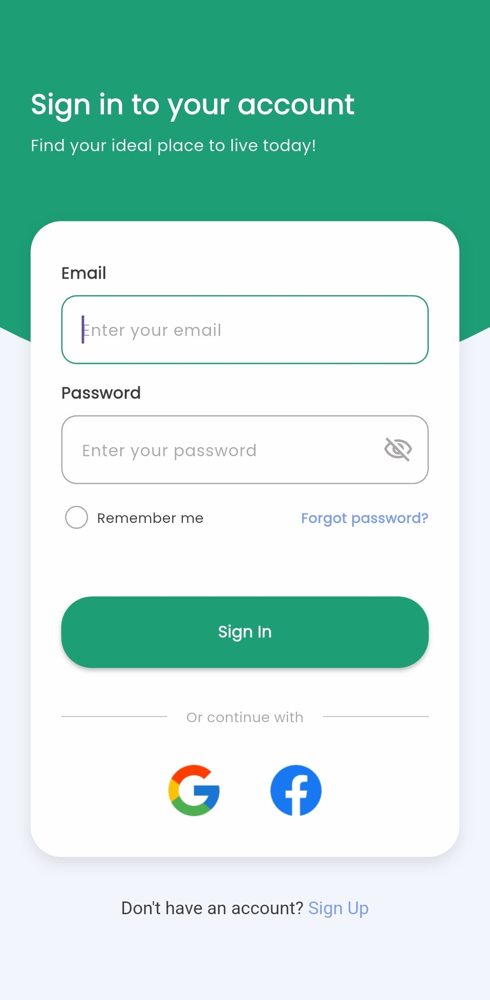
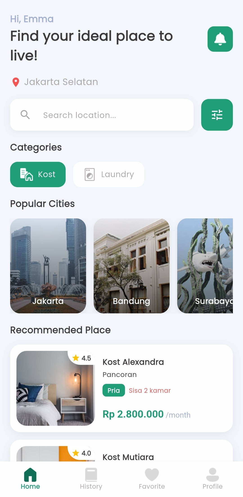
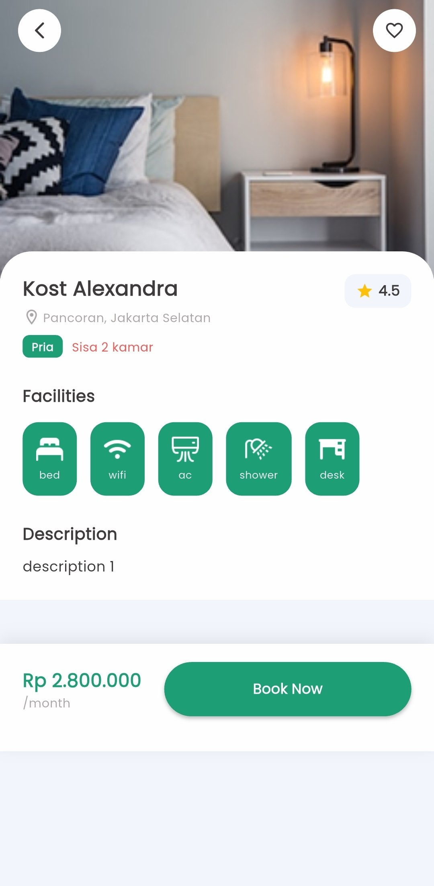

# 🏠 Hunian App

Hunian adalah aplikasi mobile pencarian hunian/kost yang memudahkan pengguna menemukan tempat tinggal ideal sesuai kebutuhan dan budget. Dibangun menggunakan Flutter dengan arsitektur MVC dan state management Provider.

---

## ✨ Fitur Utama

- **Login & Autentikasi** — Login dengan validasi form (email & password), status login tersimpan menggunakan SharedPreferences
- **Home** — Menampilkan rekomendasi kost dari REST API, pencarian berdasarkan lokasi, filter kategori (Kost/Laundry), dan daftar kota populer
- **Detail Kost** — Informasi lengkap kost meliputi fasilitas, foto, deskripsi, harga, dan ketersediaan kamar
- **Local Notification** — Notifikasi selamat datang setelah login berhasil
- **State Management** — Menggunakan Provider untuk pengelolaan state yang terstruktur
- **Local Storage** — Menyimpan status login dan token menggunakan SharedPreferences

---

## 🎨 Desain UI/UX

Desain dibuat menggunakan Figma dengan prinsip konsistensi warna, hierarki visual, dan kemudahan penggunaan.

🔗 https://www.figma.com/design/8PPckbIcqXNB9R8rHmaOJA/Hunian-App?node-id=0-1&t=6uwezDK3QMOvHhNX-1

### Color Palette

| Warna            | Hex       | Penggunaan                                |
| ---------------- | --------- | ----------------------------------------- |
| Primary          | `#1D9E75` | Brand color, button, header, active state |
| Secondary        | `#0F6E56` | Dark shade / aksen                        |
| White            | `#FEFEFE` | Background card, teks di atas warna gelap |
| Background Light | `#F2F6FC` | Background utama aplikasi                 |
| Grey             | `#ABA7A7` | Border input, divider, ikon non-aktif     |
| Text Primary     | `#3D3B3B` | Teks utama                                |
| Text Secondary   | `#A2AED0` | Teks sekunder / placeholder               |

---

## 🛠️ Tech Stack

| Teknologi                   | Kegunaan                             |
| --------------------------- | ------------------------------------ |
| Flutter                     | Framework UI                         |
| Dart                        | Bahasa pemrograman                   |
| Provider                    | State management                     |
| Dio                         | HTTP client untuk integrasi API      |
| SharedPreferences           | Local storage (status login & token) |
| flutter_local_notifications | Local notification                   |
| Google Fonts (Poppins)      | Custom font                          |
| MockAPI                     | REST API dummy                       |

---

## 📱 Tampilan Aplikasi

<p align="center">
  
  &nbsp;&nbsp;
  
  &nbsp;&nbsp;
  
</p>

---

## 🔐 Implementasi Login Screen

Halaman Login diimplementasikan menggunakan Flutter dengan:

- **Custom reusable widgets**: `CustomTextField`, `CustomButton`
- **Custom shape**: `BottomCurveClipper` untuk header melengkung
- **Form validation**:
  - Email: wajib diisi & format harus valid
  - Password: wajib diisi & minimal 8 karakter
  - Error message ditampilkan langsung di bawah masing-masing field
- **State management**: `AuthController` (Provider) dengan `TextEditingController` & `GlobalKey<FormState>`
- **Responsive layout**: `MediaQuery` & `SingleChildScrollView` untuk mencegah overflow

---

## 🌐 Integrasi API

Aplikasi mengambil data kost dari **MockAPI**:

- **Base URL**: `https://6a4b6327f5eab0bb6b62ae0b.mockapi.io/kost`
- **Endpoint**: `GET /kost` — mengambil semua data kost
- **Endpoint**: `GET /kost/:id` — mengambil detail kost berdasarkan ID
- **HTTP Client**: Dio dengan timeout 10 detik
- **Error handling**: Loading state, error state, dan empty state ditampilkan di UI

---

## 🔔 Local Notification

Notifikasi lokal ditampilkan setelah user berhasil login:

- **Title**: Login Berhasil
- **Body**: Selamat datang di Hunian! Temukan hunian idealmu.
- **Channel**: `login_channel` (Android)

---

## 💾 Local Storage

Menggunakan **SharedPreferences** untuk menyimpan:

- `is_logged_in` — status login user (boolean)
- `token` — token autentikasi (string)

---

## 🧪 Akun untuk Testing

Gunakan kredensial berikut untuk login:

| Field    | Value            |
| -------- | ---------------- |
| Email    | `emma@gmail.com` |
| Password | `password123`    |

---

## 🚀 Cara Menjalankan Project

1. Clone repository

```bash
   git clone https://github.com/riganfauzi/hunian_app.git
   cd hunian_app
```

2. Install dependencies

```bash
   flutter pub get
```

3. Jalankan aplikasi

```bash
   flutter run
```

---

## 👤 Author

- **Nama**: Rigan Nur Fauzi
- **NIM**: 24120300008
- **Mata Kuliah**: Mobile Computing
- **Tugas**: UAS — Implementasi Aplikasi Mobile dengan Flutter
